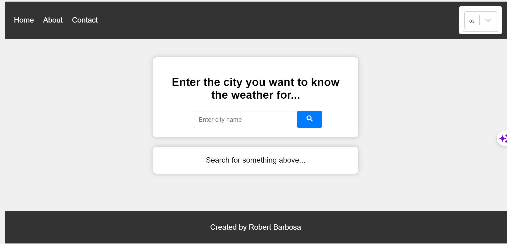

# Weather App



Este é um aplicativo de previsão do tempo simples construído com React. Ele permite que os usuários obtenham informações meteorológicas para uma cidade específica.

## Funcionalidades

- Pesquisa de previsão do tempo por nome da cidade.
- Exibição da temperatura atual, país, nome da cidade e descrição do clima.
- Ícone de clima correspondente à condição atual.

## Como usar

1. Clone o repositório para o seu ambiente local:

   ```bash
   git clone https://github.com/seu-usuario/weather-app.git

Claro, aqui está o código completo do arquivo README.md:

markdown
Copy code
# Weather App


Este é um aplicativo de previsão do tempo simples construído com React. Ele permite que os usuários obtenham informações meteorológicas para uma cidade específica.

## Funcionalidades

- Pesquisa de previsão do tempo por nome da cidade.
- Exibição da temperatura atual, país, nome da cidade e descrição do clima.
- Ícone de clima correspondente à condição atual.

## Como usar

1. Clone o repositório para o seu ambiente local:

   ```bash
   git clone https://github.com/seu-usuario/weather-app.git
      ```
Acesse o diretório do projeto:

   ```bash
Copy code
cd weather-app
Instale as dependências:
   ```
   ```bash
Copy code
npm install
   ```
Inicie o aplicativo:


   ```bash
Copy code
npm start
   ```
Abra o aplicativo em seu navegador acessando http://localhost:3000.

Configuração do Idioma
Este aplicativo suporta vários idiomas. Você pode selecionar o idioma desejado no menu suspenso no topo da página.

Recursos adicionais
React
React Router
react-i18next para internacionalização.
Ícones de clima fornecidos por react-icons.
Contribuição
Se você gostaria de contribuir para este projeto, sinta-se à vontade para criar problemas (issues) ou enviar pull requests.

Licença
Este projeto está licenciado sob a Licença MIT. Consulte o arquivo LICENSE para obter detalhes.