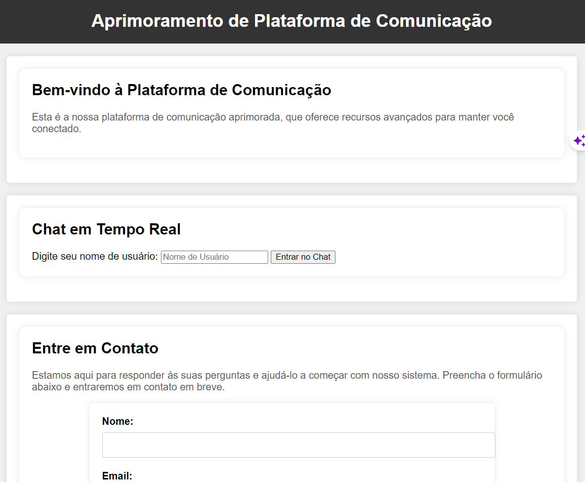

# Aprimoramento da Plataforma de Comunicação

Esta seção descreve as melhorias recentes na nossa plataforma de comunicação e documenta as novas funcionalidades e atualizações.

## Funcionalidades Adicionadas

- **Mensagens em Grupo:** Agora você pode criar e participar de mensagens em grupo, tornando a comunicação em equipe mais eficiente.

- **Notificações Personalizadas:** Personalize suas preferências de notificação para receber alertas apenas sobre as mensagens mais importantes.

- **Compartilhamento de Arquivos:** Compartilhe arquivos diretamente nas conversas para facilitar a colaboração.

## Como Utilizar

Para aproveitar ao máximo as novas funcionalidades:

1. Faça login na sua conta na plataforma de comunicação.

2. Explore as opções de mensagens em grupo e convide colegas para participar.

3. Ajuste suas configurações de notificação nas preferências da conta.

4. Experimente o recurso de compartilhamento de arquivos para compartilhar documentos e recursos.

## Tecnologias Utilizadas

- Tecnologia de Mensagens em Tempo Real
- Armazenamento em Nuvem para Compartilhamento de Arquivos
- Gerenciamento de Notificações

## Autor

Nome do Autor

## Capturas de Tela

## Melhorias Recentes

- Introdução das mensagens em grupo para melhorar a colaboração em equipe.
- Personalização das notificações para uma experiência mais tranquila.
- Compartilhamento de arquivos para facilitar o compartilhamento de recursos.

