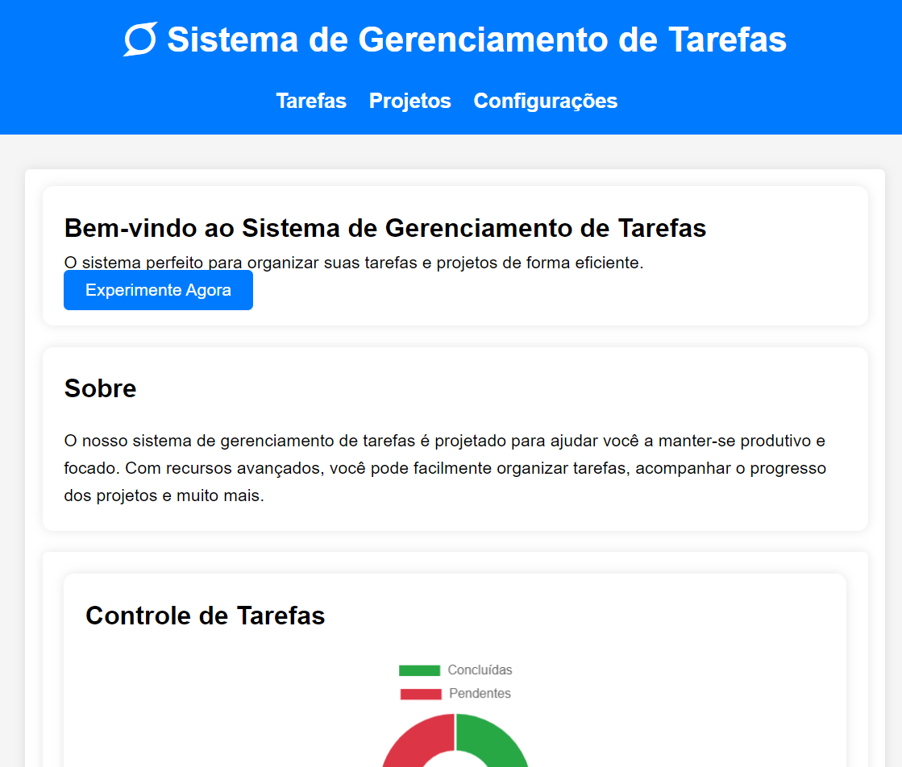
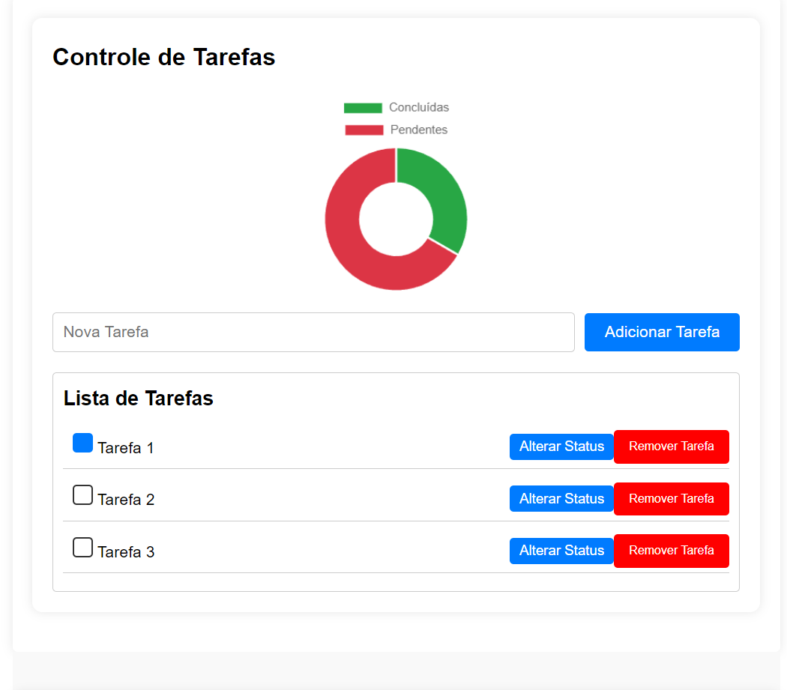
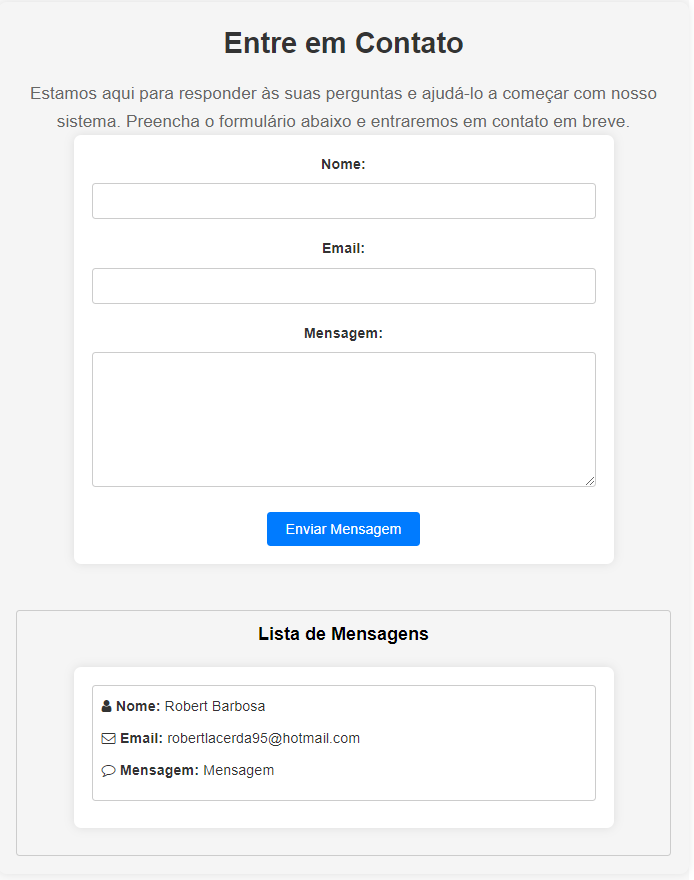

# Sistema de Gerenciamento de Tarefas

Este é um sistema de gerenciamento de tarefas desenvolvido como parte do meu portfólio. Ele inclui integração com serviços de terceiros e recursos avançados de relatórios.

## Funcionalidades

- Criação e atribuição de tarefas a usuários.
- Integração com serviços de terceiros para notificações.
- Geração de relatórios avançados de desempenho.

## Como Usar

1. Clone este repositório.
2. Abra o arquivo `index.html` em seu navegador.
3. Comece a gerenciar suas tarefas!

## Tecnologias Utilizadas

- HTML5
- CSS3
- JavaScript
- Chart.js
- Feathers Icons

## Autor

Robert Barbosa

## Capturas de Tela

## Melhorias Recentes

- Adicionou a funcionalidade de adicionar e remover tarefas.
- Aprimorou a aparência e a usabilidade com estilos responsivos.
- Adicionou a capacidade de alterar o status das tarefas.
- Atualizou o gráfico de estatísticas para exibir os valores.
- Adicionou um sistema de perguntas e respostas na seção de contato.

